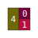
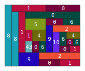

# Mondrian Nouns

A noun is either an atom (an unsigned arbitrary-precision integer, a natural number) or a cell (a pair of nouns).  Nouns are acyclic binary trees in which all leafs are atoms.  Nouns are written with `[]` brackets, but rightward-branching cells may elide brackets (i.e., `[4 [0 1]]` == `[4 0 1]` but not `[[4 0] 1]`).

Mondrian is a package for drawing nouns as compact graphical representations.

Usage:

```sh
python3 mondrian.py "[4 0 1]"
mondrian.svg: 28x28px canvas, 3 leaves, depth 2, mode=compact, min-leaf=14.0
```



```sh
python3 mondrian.py "[8 [1 0] 8 [1 6 [5 [1 43] 4 0 6] [0 6] 9 2 10 [6 4 0 6] 0 1] 9 2 0 1]"
mondrian.svg: 154x126px canvas, 27 leaves, depth 15, mode=compact, min-leaf=14.0```



